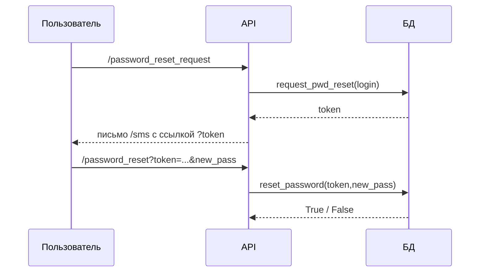

# asynHashServerDB

## Структура README.md:

markdown
Копировать
Редактировать
# Secure Async Document Server

Полноценный асинхронный сервер для безопасной работы с файлами, включая:
-  Регистрацию и авторизацию пользователей
-  Шифрование и дешифровку документов
-  Хеширование файлов и проверку дубликатов
-  Асинхронную обработку задач через FastAPI

---

## Установка и Запуск

### 1. Клонируем проект и переходим в каталог
```bash
cd /путь/к/проекту
2. Создаём виртуальное окружение
bash
Копировать
Редактировать
python -m venv venv
source venv/bin/activate      # Linux/macOS
venv\Scripts\activate         # Windows
3. Устанавливаем зависимости
bash
Копировать
Редактировать
pip install -r requirements.txt
4. Запуск сервера (разработка)
bash
Копировать
Редактировать
uvicorn main:app --host 0.0.0.0 --port 5000 --reload
5. Запуск сервера (продакшн)
bash
Копировать
Редактировать
uvicorn main:app --host 0.0.0.0 --port 5000 --workers 4
API Документация
Swagger UI доступен по адресу:
## --> http://127.0.0.1:5000/docs

## Создание systemd-сервиса (Linux)
bash
Копировать
Редактировать
sudo nano /etc/systemd/system/fastapi.service
Добавляем:

ini
Копировать
Редактировать
[Unit]
Description=FastAPI Service
After=network.target

[Service]
User=YOUR_USER
WorkingDirectory=/путь/к/проекту
ExecStart=/путь/к/проекту/venv/bin/uvicorn main:app --host 0.0.0.0 --port 5000 --workers 4
Restart=always

[Install]
WantedBy=multi-user.target
Активируем сервис:

bash
Копировать
Редактировать
sudo systemctl daemon-reload
sudo systemctl enable fastapi
sudo systemctl start fastapi
## Контакты
Разработчик: Бағдаулет Көптілеу
Дата сборки: 2025-05-10


## Мой ЛУЧШИЙ ДРУГ ЭТО ШАХРУЗ!
# Документация модуля `db_core`
Версия: 2025-05-10

## Назначение
`db_core` — минималистичный асинхронный слой доступа к базе SQLite, предназначенный для систем управления пользователями. Архитектура построена на **единой глобальной очереди** и **одном потребителе‐воркере**, что устраняет гонку данных и упрощает масштабирование кода.

## Схема данных
```sql
-- Таблица пользователей
CREATE TABLE users(
    login            TEXT PRIMARY KEY,          -- e‑mail, уникален
    full_name        TEXT,                      -- ФИО
    iin              TEXT UNIQUE DEFAULT '',    -- ИИН (может быть пуст)
    pwd              TEXT NOT NULL,             -- bcrypt‑хеш пароля
    phone            TEXT UNIQUE,               -- номер телефона
    role             TEXT,                      -- текстовая роль
    created_at       TEXT DEFAULT CURRENT_TIMESTAMP,
    last_login_at    TEXT,
    email_confirmed  INTEGER DEFAULT 0,         -- 0|1
    phone_confirmed  INTEGER DEFAULT 0,         -- 0|1
    failed_logins    INTEGER DEFAULT 0,         -- счётчик ошибок
    is_blocked       INTEGER DEFAULT 0          -- блокировка после MAX_FAILED
);

-- Таблица токенов сброса паролей
CREATE TABLE reset_tokens(
    token      TEXT PRIMARY KEY,
    login      TEXT,
    expires_at TEXT
);
```

## Архитектура
* **`asyncio.Queue`** — создаётся один раз в модуле, доступ через `get_queue()`.  
* **`DBWorker`** — потребитель; исполняется в фоне, выполняет SQL‑операции в пуле потоков.  
* **`DBProducer`** — лёгкий фасад; публикует задачи в очередь и дожидается результата через `Future`.

Благодаря этому любой код, даже в разных модулях, использует **общую очередь** и не вступает в конфликт при записи.

## Публичные методы класса `DBProducer`

| Метод | Описание | Аргументы | Возврат |
|-------|----------|-----------|---------|
| `add_user` | Создать пользователя | `login, password, full_name, phone, role='', iin=''` | `True` при успехе или `Exception` |
| `get_user` | Получить все поля по `login` | `login` | `tuple | None` |
| `del_user` | Удалить пользователя | `login` | `True` |
| `set_role` | Изменить роль | `login, role` | `True` |
| `update_password` | Сменить пароль (bcrypt‑хеш внутри) | `login, new_password` | `True` |
| `update_contacts` | Обновить `phone`, `iin` и/или `full_name` | ключевые аргументы | `True` |
| `check_free` | Проверить занятость реквизитов | `login, phone, iin` (любые) | `dict` с bool |
| `auth` | Авторизация + учёт счётчика ошибок | `login, password` | `bool` |
| `confirm_email` | Пометить почту подтверждённой | `login` | `True` |
| `confirm_phone` | Пометить телефон подтверждённым | `login` | `True` |
| `request_pwd_reset` | Сгенерировать токен на 30 мин | `login` | `token:str` |
| `reset_password` | Применить токен и новый пароль | `token, new_password` | `True|False` |
| `unblock` | Сбросить блокировку/счётчик | `login` | `True` |
| `backup` | Создать копию БД в каталоге `backups/` | `note=''` | `Path` |

### Поведение `auth`
1. Проверка существования пользователя.  
2. Если `is_blocked = 1` → `False`.  
3. Сравнение bcrypt‑хеша.  
4. При успехе обнуляется `failed_logins`, пишется `last_login_at`.  
5. При неудаче счётчик `failed_logins += 1`; если ≥ `MAX_FAILED` (по умолчанию 5) → `is_blocked = 1`.

### Сброс пароля


## Использование в приложении
```python
import asyncio
from db_core import DBWorker, DBProducer

async def main():
    asyncio.create_task(DBWorker().run())     # стартуем воркер, во всем коде только один воркер
    db = DBProducer()                         # создаём продюсер

    # пример добавления
    await db.add_user(
        login="bob@example.com",
        password="QwErTy!",
        full_name="Боб Карпов",
        phone="+77005550101",
        role="user"
    )

    # авторизация
    ok = await db.auth(login="bob@example.com", password="QwErTy!")
    print(ok)

asyncio.run(main())
```

## Резервные копии
`backup(note)` копирует файл базы в `backups/YYYYMMDD_HHMMSS_<note>.db`.  
При отсутствии основной базы воркер может восстановить **самый свежий** дамп.

## Константы
* `MAX_FAILED = 5` — число неверных паролей до блокировки  
* `TOKEN_LIFETIME = 30 мин` — срок действия токена сброса
